# 4 - Configuracion de la Maquina Virtual

- Iniciaremos la maquina virtual seleccionando `Debian GNU/Linux`.
- Introduciremos la `Contraseña de Encriptacion` que usamos, en mi caso `encrP@ssw0rd`.

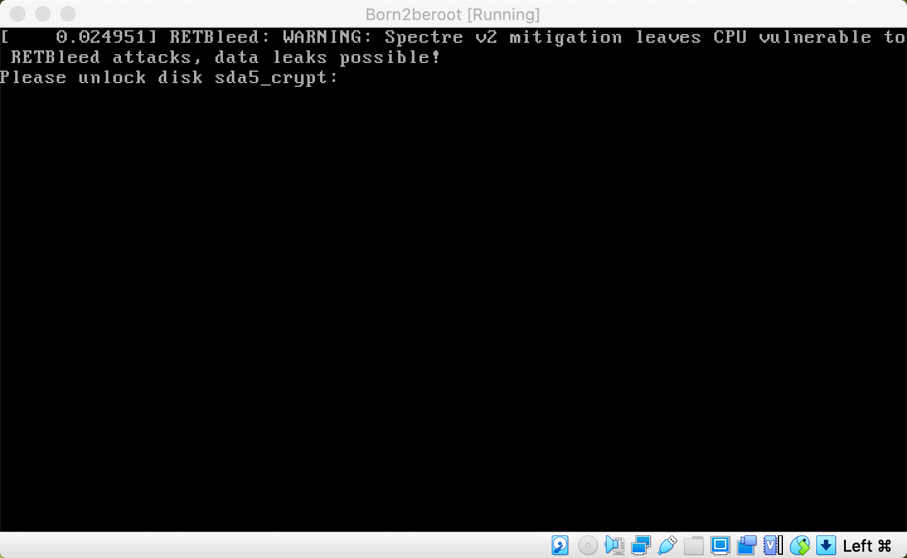

 

- A continuacion introducimos nuestro nombre de usuario, en mi caso `mendiola` y su contraseña `userP@ssw0rd`.

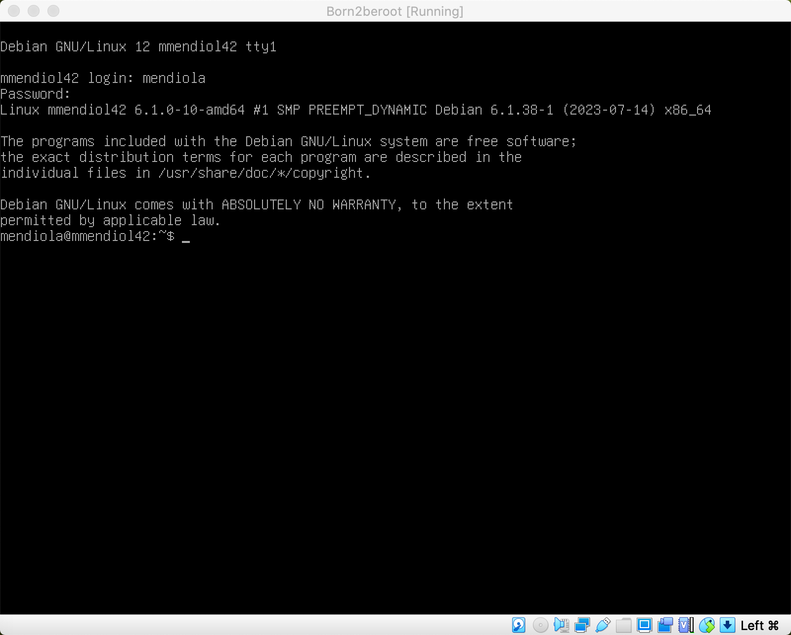

 

## 4.1 - Instalacion de Sudo y configuracion de grupos y usuarios.

Para la instalacion de sudo primero deberemos estar en el usuario `root`, y usaremos el comando `su` para cambiar de usuario y ponemos la contraseña `P@ssw0rdd1`.

1. Una vez en el usuario `root` deberemos poner el comando `apt install sudo` para instalar los paquetes necesarios.
2. Y para que se apliquen los cambios deberemos reiniciar la maquina virtual, para ello usamos el comando `sudo reboot`.
    
    
    
     
    
3. Al volver abrir la maquina introducimos de nuevo las contraseñas y entramos de nuevo al usuario `root`. Y ahora para comprobar que se instalo correctamente usaremos el comando `sudo -V` para comprobar la version de instalacion de sudo.
    
    
    
     
    
4. A continuacion probamos a añadir el usuario que ya tenemos creado con `sudo adduser *USER*` y nos tiene que mostrar que ya esta creado.
    
    Seguidamente añadimos el grupo user42 con `sudo addgroup user42` y agregamos el usuario que tenemos al nuevo grupo con `sudo adduser *User* user42`.
    
    **Que es GID❓** es la abreviatura de `Group ID`, podriamos decir que es su identificador.
    
    🤔 **Se ha creado correctamente el grupo?** Lo cierto es que si ya que no ha habido ningún mensaje de error, aún así podemos comprobar si se ha creado con el comando `getent group nombre_grupo` o también podemos hacer `cat /etc/group` y podremos ver todos los grupos y los usuarios que hay dentro de ellos.
    
    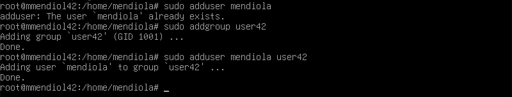
    
     
    
5. Una vez los hayamos introducido para checkear que todo se haya hecho correctamente podemos ejecutar el comando `getent group GROUP_NAME`o tambien podemos editar el fichero /etc/group `nano /etc/group` y en los grupos `sudo` y `login42` debera aparecer nuestro usuario.
    
    
    

## 4.2 - Instalacion y configuracion SSH.

**Que es SSH❓** Es el nombre de un protocolo y del programa que lo implementa cuya principal función es el acceso remoto a un servidor por medio de un canal seguro en el que toda la información está cifrada.

1. Primero actualizaremos los repositorios que definimos en el archivo `/etc/apt/sources.list` usando `sudo apt update`.
    
    
    
     
    
2. Ahora instalaremos la herramienta principal para poder tener la conectividad con el protocolo SSH, llamada OpenSSH. Usaremos `sudo apt install openssh-server` y diremos que si queremos empezar la instalacion.
    
    
    
     
    
3. Para comprobar la instalacion usaremos `sudo service ssh status` y debera estar `activo`.
    
    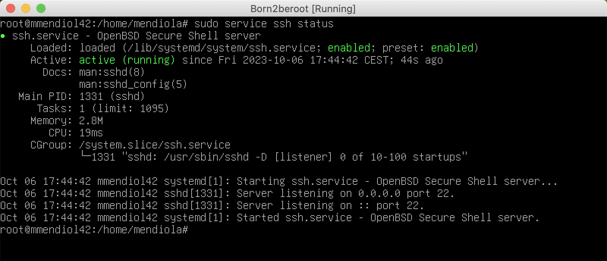
    
     
    
4. Tendremos que modificar algunos ficheros y para eso usaremos `Nano` o el editor que prefieras. Deberemos estar en el usuario root y modificaremos el archivo `/etc/ssh/sshd_config`.
    
    
    
     
    
5. Ahora veremos el documento con este estilo. Las frases que comienzan con # son comentarios y algunas de esas lineas las cambiaremos.
    
    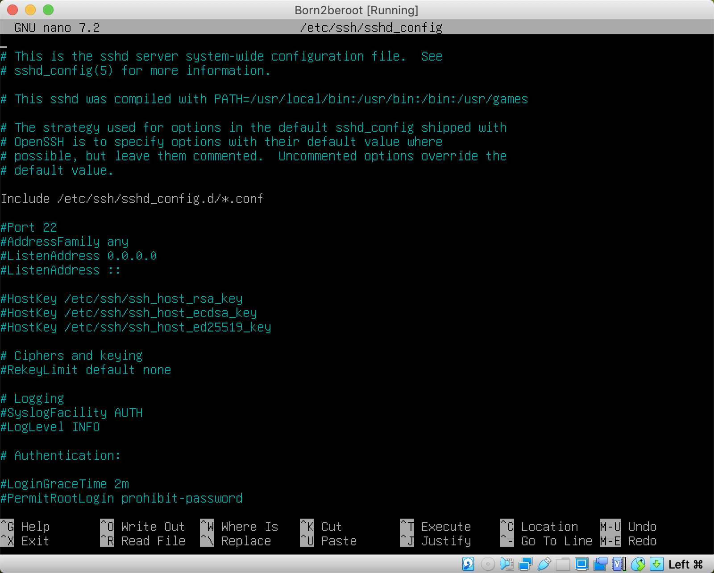
    
    - Primero pasamos de #Port 22 → Port 4242.
    
    
    
    - Cambiamos #PermitRootLogin prohibit-password -> PermitRootLogin no
    
    
    
     
    
6. Una vez terminado estas modificaciones guardamos el fichero con `ctrl + x` y salimos del archivo escribiendo `Y` y finalmente apretaremos `Enter`.
7. Ahora modificaremos `/etc/ssh/ssh_config`
    
    
    
     
    
8. Y volveremos a cambiar de #Port 22 → Port 4242.
    
    
    
     
    
9. Por ultimo para guardar los cambios deberemos resetear el servicio ssh con el comando `sudo service ssh restart` y cuando se reinicie miraremos el `status` del servicio para ver los cambios de los puertos a 4242.
    
    
    

## 4.3 - Instalacion y configuracion de UFW.

**Que es [UFW](https://es.wikipedia.org/wiki/Uncomplicated_Firewall)❓** Es un [firewall](https://es.wikipedia.org/wiki/Cortafuegos_(inform%C3%A1tica)) el cual utiliza la línea de comandos para configurar las [iptables](https://es.wikipedia.org/wiki/Iptables) usando un pequeño número de comandos simples.

1. Lo primero de todo deberemos instalar UFW y usaremos el comando `sudo apt install ufw` y confirmaremos la instalacion con una y.
    
    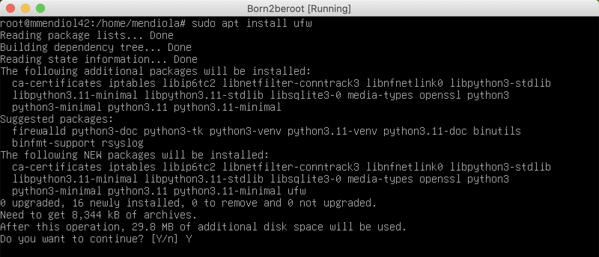
    
     
    
2. Lo siguiente que deberemos hacer es habilitarlo usando el comando `sudo ufw enable` y seguido nos debe mostrar un mensaje que nos dice que firewall esta activo.
    
    
    
     
    
3. Ahora permitiremos la conexiones con el puerto 4242 con el comando `sudo ufw allow 4242`.
    
    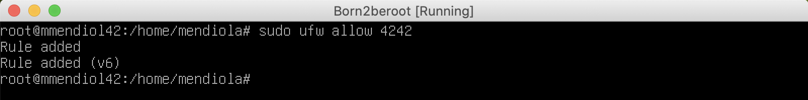
    
     
    
4. Para terminar miraremos el estado de nuestro firewall para ver si esta todo correctamente configurado con `sudo ufw status`.
    
    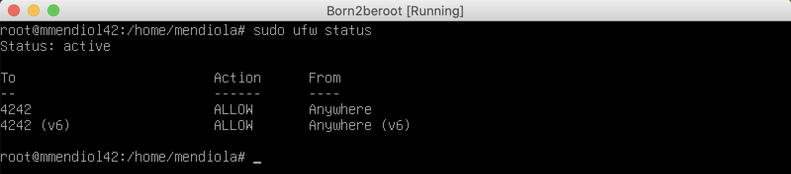
    

## 4.4 - Configurar contraseña fuerte para sudo.

1. Creamos un fichero donde se almacenara la configuracion de la contraseña. Crearemos el fichero con el comando `touch /etc/sudoers.d/config-sudo`.
    
    
    
     
    
2. Ahora crearemos el directorio donde cada comando de sudo quedara alamcenado. Usaremos `mkdir /var/log/sudo`.
    
    
    
     
    
3. Abriremos el fichero que nos hemos creado anteriormente usando el comando `nano /etc/sudoers.d/config-sudo`.
    
    
    
     
    
4. Para cumplir el subject deberemos añadir los siguientes comandos.
    
    ```c
    Defaults  passwd_tries=3
    Defaults  badpass_message="Mensaje de error personalizado"
    Defaults  logfile="/var/log/sudo/sudo_config"
    Defaults  log_input, log_output
    Defaults  iolog_dir="/var/log/sudo"
    Defaults  requiretty
    Defaults  secure_path="/usr/local/sbin:/usr/local/bin:/usr/sbin:/usr/bin:/sbin:/bin:/snap/bin"
    ```
    
    
    
     
    
5. Que hace cada comando y como quedaria.
    
    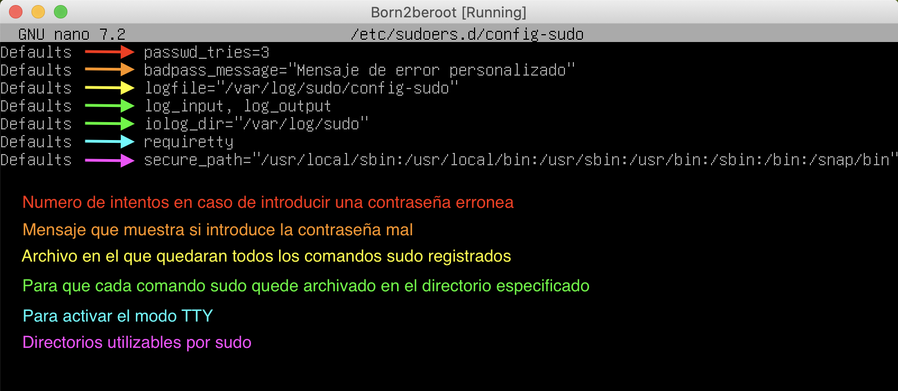
    

## 4.5 - Configuracion de politica de contraseñas fuerte.

1. Editamos el fichero `login.defs`.
    
    
    
     
    
2. Una vez abierto moddificaremos los siguientes parametros:
    1. PASS_MAX_DAYS 99999 -> PASS_MAX_DAYS 30
    2. PASS_MIN_DAYS 0 -> PASS_MIN_DAYS 2

    
        
        
        - PASS_MAX_DAYS: Es el tiempo de expiración de la contraseña. El numero = a días.
        - PASS_MIN_DAYS: Dias mínimos permitidos antes de modificar una contraseña.
        - PASS_WARN_AGE: El usuario recibira un mensaje de aviso indicando que faltan los dias especificados para que expire su contraseña.
        
3. Para seguir con la configuracion deberemo instalar unos paquetes con el comando `sudo apt install libpam-pwquality`.
    
    
    
     
    
4. Ahora modificaremos un archivo con `nano /etc/pam.d/common-password`.
    
    
    
     
    
5. Ahora añadiremos todas estas lineas despues de `retry=3`.


minlen=10 ucredit=-1 dcredit=-1 lcredit=-1 maxrepeat=3 reject_username difok=7 enforce_for_root

**Que hace cada comando❓**

minlen=10 ➤ La cantidad minima de caracteres que debe contener la contraseña.

ucredit=-1 ➤ Como mínimo debe contener una letra mayúscula. Ponemos el - ya que debe contener como mínimo un caracter, si ponemos + nos referimos a como maximo esos caracteres.

dcredit=-1 ➤ Como mínimo debe contener un digito.

lcredit=-1 ➤ Como mínimo debe contener una letra minúscula.

maxrepeat=3 ➤ No puede tener más de 3 veces seguidas el mismo caracter.

reject_username ➤ No puede contener el nombre del usuario.

difok=7 ➤ Debe tener al menos 7 caracteres que no sean parte de la antigua contraseña.

enforce_for_root ➤ Implementaremos esta política para el usuario root.

## 4.6 - Conectarse via SSH.

1. Deberemos cerrar la maquina virtual y darle a configurar desde VirtualBox.
    
    
    
     
    
2. Seguido pinchamos sobre `Red` y pinchamos en `Avanzadas` para poder llegar a `Reenvio de puertos`.
    
    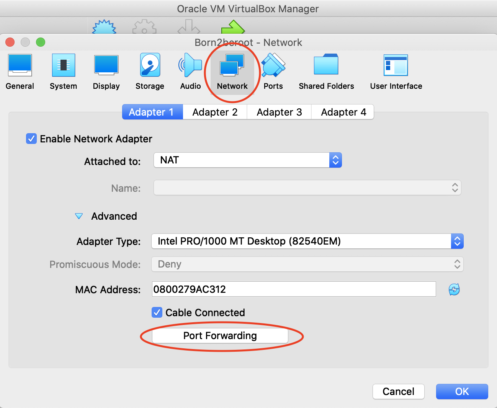
    
     
    
3. Ahora agregamos una regla de reenvio.
    
    
    
     
    
4. Y en el puerto anfrition y al invitado le añadimos el puerto 4242.
    
    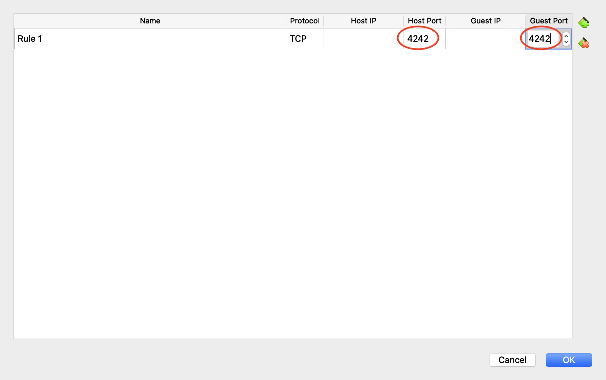
    
     
    
5. Para poder conectarnos a la maquina virtual desde la real deberemos escribir el comando `ssh mendiola@localhost -p 4242` y nos pedira la clave de usuario. Cuando nos salga el login en verde sera que estaremos conectados.
    
    