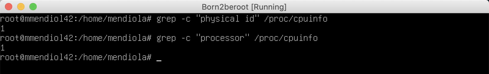
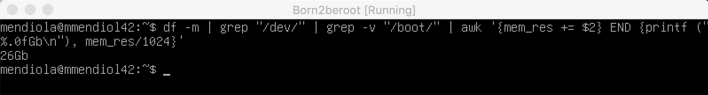
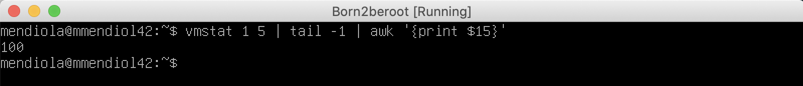
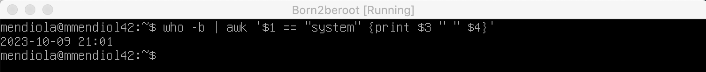
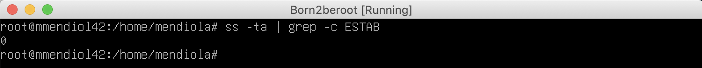
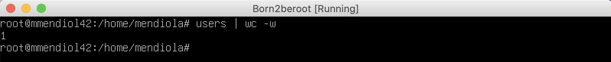
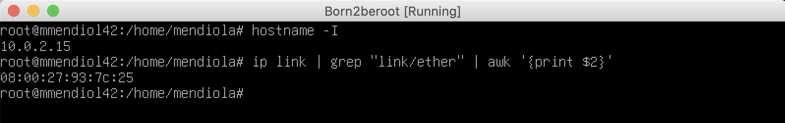
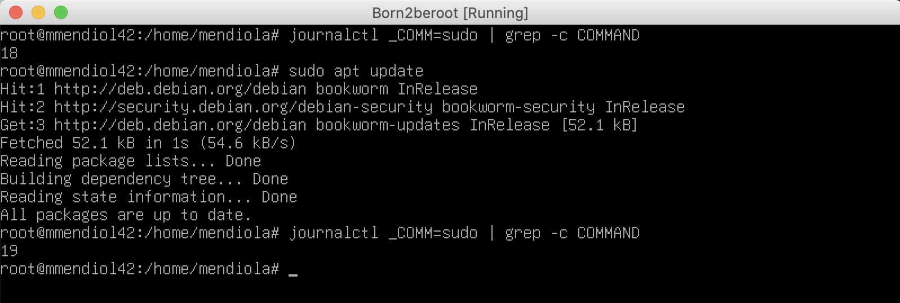

# 5 - Script

Esta parte es una de las mas importantes ya que tendras que explicar cada comando si el examinador nos lo pide.

## 5.1 - Ver la Arquitectura.

Para ver la arquitectura del SO y su version utilizamos `uname —all` o `uname -a`.


 

## 5.2 - Nucleos Fisicos y Nucleos Virtuales.

Ahora usaremos el fichero `/proc/cpuinfo` donde nos proporcionara toda la informacion sobre el procesador que necesitamos. Usaremos `grep -c “physical id” /proc/cpuinfo` con grep -c buscaremos dentro del fichero physical id y con -c sacaremos el contador de las lineas.

Y despues haremos lo mismo para mostrar los nucleos virutales usando `grep -c “processor” /proc/cpuinfo` para mostrarnos el contador de los virtuales.



 

## 5.3 - Memoria RAM.

Usaremos free para ver informacion sobre la RAM. Especificada por el pdf nos dice que miremos los mega asique usaremos `free —mega`.

Luego usaremos el `awk ‘$1 == “Mem:” {print $3}’` . El awk es para procesar los datos y poder usar los que nos interesen. En este caso comprobaremos que la primera fila sea “Mem:” y mostraremos con print el valor que deseamos, puede ser el 2 o el 3.

La linea de comandos final sera `free —mega | awk ‘$1 == “Mem:” {print $3}’` y finalmente lo guardaremos en una variable par asarlo mas adelante. Esto sera la ram usada.

`free —mega | awk ‘$1 == “Mem:” {print $2}’` sera la ram total.

`free —mega | awk ‘$1 == “Mem:” {printf("%.2f"), $3/$2*100}’` y con este sabremos el porcentaje de memoria usada en total


 

## 5.5 - Memoria del disco.

Usaremos `df` que significa “disk filesystem” que lo usamos para obtener la informacion de uso del espacio en disco. 

Usamos `-m` porque la memoria usada es en megabytes.

Despues `grep “/dev/”` para que nos muestre las lineas de dev.

Seguido hacemos un `grep -v “/boot/”` para excluir esas lineas de boot.

Y por ultimo usamos `awk ‘{memory_use += $3} END {print memory_use}’` para sumar la tercera palabra de cada linea para despues mostrarlas todas.

Quedando asi: `df -m | grep “/dev/” | grep -v “/boot/” | awk ‘{memory_use += $3} END {print memory_use}’`.


 

El siguiente comando que tendremos que hacer lo haremos para obtener el espacio total y solo cambiaremos los ultimos digitos para conseguir algo distinto.

Usaremos `awk ‘{mem_res += $2} END {printf (%.1fGb), mem_res/1024}’` para sumar la segunda palabra de cada linea para despues mostrarlas todas y al estar en MB tendremos que transformarlo a Gb asique quitaremos los decimales y sacaremos los Gb dividiendo entre 1024.

Quedando asi: `df -m | grep “/dev/” | grep -v “/boot/” | awk ‘{mem_res += $2} END {printf (%.0fGb), mem_res/1024}’`.



 

Por ultimo deberemos mostrar el porcentaje de la memoria usada, utilizando los dos anteriores scripts de base.

Usaremos `awk ‘{mem_res += $2} {mem_use += $3} END {printf ("(%d%%)"), mem_use/mem_res*100’` para sacar la segunda palabra(total) en mem_res y despues la tercera palabra(usado) en mem_use y despues tenemos que sacar el procentaje de la memoria total usada.


 

## 5.6 - Porcentaje de uso de la CPU.

Para esto usaremos `vmstat`, que nos muestra las estadisticas del sistema permitiendonos obtener un gran detalle general de una gran cantidad de cosas y añadiremos un tiempo de 1 a 5 segundos.

Despues usaremos `tail -1` para que producta el output la ultima linea de las generadas.

Despues mostraremos la linea 15 la cual nos muestra el uso de la memoria disponible con `awk ‘{print $15}'`.

Por ultimo guardaremos el resultado en % usando `expr 100 - vmstat 1 5 | tail -1 | awk '{print $15}'`.



 

## 5.7 - Ultimo reinicio.

Para saber la hora y fecha de reinicio usaremos `who -b` con el que veremos el ultimo arranque de sistema. Ahora haremos un filtro de informacion usando de nuevo awk para ver si la primera file es igual a “system” y mostraremos la tercera fila que es la fecha y la cuarta fila que es la hora: `awk ‘$1 == “system” {print $3 “ ” $4}’`.



 

## 5.8 - Uso de LVM.

Para ver si LVM esta activo usaremos `lsblk`, que muestra informacion sobre los dispositivos de almacenamiento del sistema

 Despues realizaremos un if porque nuestra finalidad sera responder con un Yes o un No. Haremos un if en el cual si el contador de lineas en lvm es mayor que 0 mostraremos Yes, en caso contrario mostraremos No.

Asi quedaria nuestro if: `if [ $(lsblk | grep -c lvm) -gt 0 ];then echo yes; else echo no; fi`.


 

## 5.9 - Conexiones TCP.

Utilizaremos el comando `ss -ta` para que nos muestre solo las conexiones TCP en vez toda la informacion de los sockets.

Por ulitmo contaremos el numero de lineas de conexiones establecidas con un `grep -c ESTAB`.

Quedando asi: `ss -ta | grep -c ESTAB`.



 

## 5.10 - Numero de Usuarios.

Poniendo `users` nos da el nombre de todos los usuarios, y añadiendo `wc -w`.

Quedando: `users | wc -w`.



 

## 5.11 - Direccion IP y MAC

Para obtener la direccion host usaremos `hostname -I`.

Y para obtener la ip usaremos ip link que nos muestra las interfaces de las redes y utilizaremos grep para seleccionar la seccion que deseamos en este caso ether y seleccionamos que nos muestre la segunda linea quedando: `ip link | grep “link/ether” | awk ‘{print $2}’`.



 

## 5.12 - Comandos ejecutados con Sudo.

Usaremos `journalctl` que recopila y administra los registros del sistema y filtraremos la entrada de la ruta con _COMM=sudo. Usaremos _COMM ya que es un script ejecutable y filtraremos mas ya que solo queremos los comandos y contaremos las lineas asique seguiremos usando grep -c COMMAND quedando: `journalctl _COMM=sudo | grep -c COMMAND`.

Para comprobar podemos hacer otro comando con sudo y ver la diferencia.



 

## 5. Final - Resultado.

Antes de realizar este script deberias aprender que hace cada comando y porque se hacen en cada situacion.

```c
#!/bin/bash

# ARCH
arch=$(uname -a)

# CPU PHYSICAL
cpuf=$(grep "physical id" /proc/cpuinfo | wc -l)

# CPU VIRTUAL
cpuv=$(grep "processor" /proc/cpuinfo | wc -l)

# RAM
ram_total=$(free --mega | awk '$1 == "Mem:" {print $2}')
ram_use=$(free --mega | awk '$1 == "Mem:" {print $3}')
ram_percent=$(free --mega | awk '$1 == "Mem:" {printf("%.2f"), $3/$2*100}')

# DISK
disk_total=$(df -m | grep "/dev/" | grep -v "/boot" | awk '{disk_t += $2} END {printf ("%.1fGb\n"), disk_t/1024}')
disk_use=$(df -m | grep "/dev/" | grep -v "/boot" | awk '{disk_u += $3} END {print disk_u}')
disk_percent=$(df -m | grep "/dev/" | grep -v "/boot" | awk '{disk_u += $3} {disk_t+= $2} END {printf("%d"), disk_u/disk_t*100}')

# CPU LOAD
cpul=$(vmstat 1 2 | tail -1 | awk '{printf $15}')
cpu_op=$(expr 100 - $cpul)
cpu_fin=$(printf "%.1f" $cpu_op)

# LAST BOOT
lb=$(who -b | awk '$1 == "system" {print $3 " " $4}')

# LVM USE
lvmu=$(if [ $(lsblk | grep "lvm" | wc -l) -gt 0 ]; then echo yes; else echo no; fi)

# TCP CONNEXIONS
tcpc=$(ss -ta | grep ESTAB | wc -l)

# USER LOG
ulog=$(users | wc -w)

# NETWORK
ip=$(hostname -I)
mac=$(ip link | grep "link/ether" | awk '{print $2}')

# SUDO
cmnd=$(journalctl _COMM=sudo | grep COMMAND | wc -l)

wall "	Architecture: $arch
	CPU physical: $cpuf
	vCPU: $cpuv
	Memory Usage: $ram_use/${ram_total}MB ($ram_percent%)
	Disk Usage: $disk_use/${disk_total} ($disk_percent%)
	CPU load: $cpu_fin%
	Last boot: $lb
	LVM use: $lvmu
	Connections TCP: $tcpc ESTABLISHED
	User log: $ulog
	Network: IP $ip ($mac)
	Sudo: $cmnd cmd"
```

De esta forma se veria en el script:


Y asi se veria el script ejecutado.

