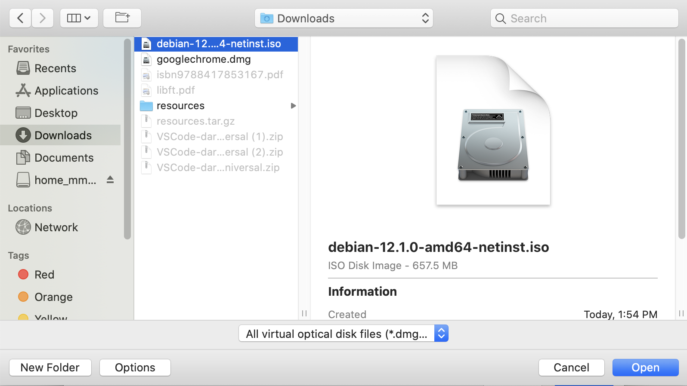

# 2 - Virtual Machine Installation.

Here we will make use of [VirtualBox](https://www.virtualbox.org/), a virtualization software. Once you have VirtualBox installed and the ISO downloaded, we can begin the installation.

1. Open VirtualBox and add a new machine.
    
    
    
     
    
2. Enter the name of your virtual machine and select the path where you will save it. This path may vary depending on the device, but generally, we will aim to save it in sgoinfre to have enough space for the installation. 
    
    Change the version from the default to Debian (64-bit).
    
    
    
     
    
3. Choose the amount of RAM you want to reserve for the machine.
    
    
    
     
    
4. Create a virtual hard drive by selecting the second option.
    
    
    
     
    
5. Select the disk image, the first option being `VDI`.
    
    
    
     
    
6. Reserve the memory `dynamically` to allocate it on our real machine while using it up to the maximum limit of the virtual.
    
    
    
     
    
7. Once the recommended amount of `8 GB` is set, click on create. However, if you want to complete the bonus, select `30.80 GB` as specified in the PDF.
    
    
    
      
    
8. Go to settings to finish the last steps of the machine installation.
    
    
    
     
    
9. First, go to `Storage`, then click on the `Empty` disk under the controller, and finally, click on `Choose a disk file` by clicking on the 💿 icon on the right.

    
    
    
     
    
10. Select the ISO you downloaded earlier and `Open`, finishing by clicking `OK`.
    
    
    
     
    
11. Once all the steps are completed, you can `Start` your virtual machine.
    
    