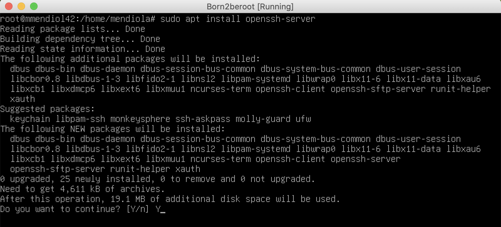
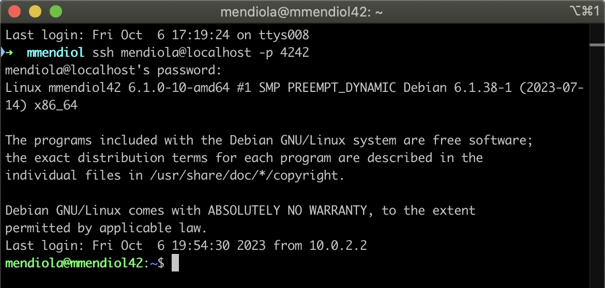

# 4 - Virtual Machine Configuration.

- Start the virtual machine by selecting `Debian GNU/Linux`.
- Enter the `Encryption Password` you used, in my case `encrP@ssw0rd`.


 

- Next, enter your username, in my case `mendiola`, and its password `userP@ssw0rd`.


 

## 4.1 - Sudo Installation and Group/User Configuration.

To install sudo, first switch to the `root` user using the `su` command with the password `P@ssw0rdd1`.

1. Once in the `root` user, use the command `apt install sudo` to install the necessary packages.
2. To apply the changes, restart the virtual machine with the command `sudo reboot`.
    
    
    
     
    
3. After reopening the machine, re-enter the passwords and switch back to the `root` user. Now, check if sudo is installed correctly using the command `sudo -V` to verify the sudo installation.
    
    
    
     
    
4. Next, try adding the user you already created with `sudo adduser *USER*`. It should show that the user is already created.
    
    Then, add the user42 group with `sudo addgroup user42` and add the existing user to the new group with `sudo adduser *User* user42`.
    
    **What is GID❓** It is the abbreviation for `Group ID`, which can be considered its identifier.
    
    🤔 **Has the group been created successfully?** Indeed, yes, as there has been no error message. However, we can verify its creation with the command `getent group group_name` or alternatively, `cat /etc/group` to see all groups and the users within them.
    
    
    
     
    
5. Once these steps are completed, to check that everything has been done correctly, we can execute the command `getent group GROUP_NAME` or alternatively, edit the file /etc/group using `nano /etc/group`. In the groups `sudo` and `login42`, our user should appear.
    
    
    

## 4.2 - Installation and Configuration of SSH.

**What is SSH❓** It is the name of a protocol and the program that implements it, whose main function is remote access to a server through a secure channel where all information is encrypted.

1. First, we will update the repositories defined in the file `/etc/apt/sources.list` using `sudo apt update`.
    
    
    
     
    
2. Now, we will install the main tool for SSH connectivity, called OpenSSH. We will use `sudo apt install openssh-server` and confirm the installation with 'y'.
    
    
    
     
    
3. To check the installation, we will use `sudo service ssh status`, and it should be `active`.
    
    
    
     
    
4. We need to modify some files, and for that, we will use `Nano` or your preferred editor. We should be in the root user, and we will modify the file `/etc/ssh/sshd_config`.
    
    
    
     
    
5. Now, we will see the document with this style. Lines starting with # are comments, and we will change some of those lines.
    
    
    
    - Change from #Port 22 → Port 4242.
    
    
    
    - Change #PermitRootLogin prohibit-password -> PermitRootLogin no
    
    
    
     
    
6. Once these modifications are done, save the file with `ctrl + x`, exit the file by typing `Y`, and finally, press `Enter`.
7. Now, we will modify `/etc/ssh/ssh_config`.
    
    
    
     
    
8. Change from #Port 22 → Port 4242.
    
    
    
     
    
9. Finally, to save the changes, we need to restart the ssh service with the command `sudo service ssh restart`. When it restarts, check the `status` of the service to see the port changes to 4242.
    
    
    

## 4.3 - Instalacion y configuracion de UFW.

**What is [UFW](https://es.wikipedia.org/wiki/Uncomplicated_Firewall)❓** It is a [firewall](https://es.wikipedia.org/wiki/Cortafuegos_(inform%C3%A1tica)) that uses the command line to configure [iptables](https://es.wikipedia.org/wiki/Iptables) using a small number of simple commands.

1. First, we need to install UFW using the command `sudo apt install ufw`, and we confirm the installation with `y`.
    
    
    
     
    
2. Next, we enable it using the command `sudo ufw enable`, and it should show a message stating that the firewall is active.
    
    
    
     
    
3. Now, we allow connections on port 4242 with the command `sudo ufw allow 4242`.
    
    
    
     
    
4. To finish, check the status of our firewall to see if everything is correctly configured with `sudo ufw status`.
    
    
    

## 4.4 - Configure Strong Password for sudo.

1. Create a file where the password configuration will be stored. Create the file with the command `touch /etc/sudoers.d/sudo_config`.
    
    
    
     
    
2. Now create the directory where each sudo command will be stored. Use `mkdir /var/log/sudo`.
    
    
    
     
    
3. Open the file we created earlier using the command `nano /etc/sudoers.d/sudo_config`.
    
    
    
     
    
4. To meet the subject, add the following commands.
    
    ```c
    Defaults  passwd_tries=3
    Defaults  badpass_message="Mensaje de error personalizado"
    Defaults  logfile="/var/log/sudo/sudo_config"
    Defaults  log_input, log_output
    Defaults  iolog_dir="/var/log/sudo"
    Defaults  requiretty
    Defaults  secure_path="/usr/local/sbin:/usr/local/bin:/usr/sbin:/usr/bin:/sbin:/bin:/snap/bin"
    ```
    
    
    
     
    
5. What each command does and how it would look.
    
    
    

## 4.5 - Strong Password Policy Configuration.

1. Edit the `login.defs` file.
    
    
    
     
    
2. Once opened, modify the following parameters:
    1. PASS_MAX_DAYS 99999 -> PASS_MAX_DAYS 30
    2. PASS_MIN_DAYS 0 -> PASS_MIN_DAYS 2

    
        
        
        - PASS_MAX_DAYS: Expiration time of the password. The number equals days.
        - PASS_MIN_DAYS: Minimum days allowed before changing a password.
        - PASS_WARN_AGE: The user will receive a warning message indicating the specified days remaining until their password expires.
        
3. To continue with the configuration, install some packages with the command `sudo apt install libpam-pwquality`.
    
    
    
     
    
4. Now modify a file with `nano /etc/pam.d/common-password`.
    
    
    
     
    
5. Now add all these lines after `retry=3`.


minlen=10 ucredit=-1 dcredit=-1 lcredit=-1 maxrepeat=3 reject_username difok=7 enforce_for_root

**What each command does❓**

minlen=10 ➤ The minimum number of characters the password must contain.

ucredit=-1 ➤ At least one uppercase letter must be included. We use - because it must contain at least one character. If we use +, it refers to a maximum of those characters.

dcredit=-1 ➤ At least one digit must be included.

lcredit=-1 ➤ At least one lowercase letter must be included.

maxrepeat=3 ➤ It cannot have the same character more than 3 times in a row.

reject_username ➤ It cannot contain the username.

difok=7 ➤ It must have at least 7 characters that are not part of the old password.

enforce_for_root ➤ Implement this policy for the root user.

## 4.6 - Connect via SSH.

1. Close the virtual machine and click on Settings in VirtualBox.
    
    
    
     
    
2. Click on `Network` and then on `Advanced` to reach `Port Forwarding`.
    
    
    
     
    
3. Now add a forwarding rule.
    
    
    
     
    
4. Add port 4242 to both the host and guest.
    
    
    
     
    
5. To connect to the virtual machine from the host, we need to execute the command `ssh mendiola@localhost -p 4242`, and it will prompt us for the user password. Once the login appears in green, it indicates that we are connected.
    
    
