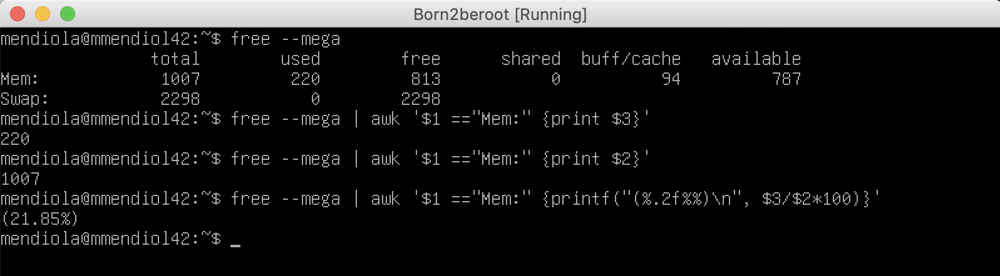

# 5 - Script

This part is one of the most important as you will have to explain each command if the examiner asks for it.

## 5.1 - View Architecture.

To view the architecture of the OS and its version, we use `uname --all` or `uname -a`.


 

## 5.2 - Physical and Virtual Cores.

Now we will use the file `/proc/cpuinfo`, which provides all the information about the processor that we need. We will use `grep -c "physical id" /proc/cpuinfo` to search for "physical id" within the file, and with -c, we will count the lines.

And then we will do the same to display the virtual cores using `grep -c "processor" /proc/cpuinfo` to show the virtual counter.


 

## 5.3 - Memoria RAM.

We will use free to see information about RAM. As specified in the PDF, we are instructed to look at the megabytes, so we will use `free --mega`.

Then we will use `awk '$1 == "Mem:" {print $3}'`. The awk is to process the data and use the ones we are interested in. In this case, we check that the first row is "Mem:" and show with print the value we want, which can be the 2nd or the 3rd.

The final command line will be `free --mega | awk '$1 == "Mem:" {print $3}'`, and finally, we will save it in a variable to use it later. This will be the used RAM.

`free --mega | awk '$1 == "Mem:" {print $2}'` will be the total RAM.

`free --mega | awk '$1 == "Mem:" {printf("%.2f"), $3/$2*100}'` will show the percentage of total used memory.



 

## 5.5 - Memoria del disco.

We will use `df` which stands for "disk filesystem" and is used to obtain information about disk space usage.

We use `-m` because the used memory is in megabytes.

Then `grep "/dev/"` to show lines with "dev."

Next, we do `grep -v "/boot/"` to exclude those lines with "boot."

Finally, we use `awk '{memory_use += $3} END {print memory_use}'` to sum the third word of each line and then show them all.

So it looks like this: `df -m | grep "/dev/" | grep -v "/boot/" | awk '{memory_use += $3} END {print memory_use}'`.


 

The next command that we have to do is to get the total space, and we will change only the last digits to get something different.

We will use `awk '{mem_res += $2} END {printf "%.1fGb", mem_res/1024}'` to sum the second word of each line and then show them all. As it is in MB, we will have to transform it to Gb, so we will remove the decimals and get the Gb by dividing by 1024.

So it looks like this: `df -m | grep "/dev/" | grep -v "/boot/" | awk '{mem_res += $2} END {printf "%.0fGb", mem_res/1024}'`.


 

Finally, we need to show the percentage of used memory, using the two previous base scripts.

We will use `awk '{mem_res += $2} {mem_use += $3} END {printf "(%d%%)", mem_use/mem_res*100}'` to get the second word (total) into mem_res and then the third word (used) into mem_use, and then we have to get the percentage of the total used memory.


 

## 5.6 - CPU Usage Percentage.

For this, we will use `vmstat`, which shows system statistics allowing us to obtain a general detailed overview of a large number of things and will add a time from 1 to 5 seconds.

Then we will use `tail -1` so that it outputs the last line of the generated ones.

Then we will show line 15, which shows the available memory usage with `awk '{print $15}'`.

Finally, we will save the result in % using `expr 100 - vmstat 1 5 | tail -1 | awk '{print $15}'`.


 

## 5.7 - Last Reboot.

To know the time and date of the last reboot, we will use `who -b` to see the last system boot. Now we will filter information using awk again to see if the first row is equal to "system," and we will show the third row, which is the date, and the fourth row, which is the time: `awk '$1 == "system" {print $3 " " $4}'`.


 

## 5.8 - LVM Usage.

To see if LVM is active, we will use `lsblk`, which shows information about the storage devices of the system.

Then we will perform an if because our goal will be to respond with a Yes or a No. We will do an if in which if the line counter in LVM is greater than 0, we will show Yes; otherwise, we will show No.

So, our if would be: `if [ $(lsblk | grep -c lvm) -gt 0 ]; then echo yes; else echo no; fi`.


 

## 5.9 - TCP Connections.

We will use the command `ss -ta` to show only TCP connections instead of all socket information.

Finally, we will count the number of lines of established connections with `grep -c ESTAB`.

So it looks like this: `ss -ta | grep -c ESTAB`.


 

## 5.10 - Number of Users.

By using `users`, it gives us the names of all users, and adding wc -w.

So it looks like this: `users | wc -w`.


 

## 5.11 - IP Address and MAC Address.

To obtain the host address, we will use `hostname -I`.

And to obtain the IP, we will use ip link, which shows the network interfaces, and we will use grep to select the section we want, in this case, ether, and we will select it to show the second line, as follows: `ip link | grep "link/ether" | awk '{print $2}'`.


 

## 5.12 - Commands Executed with Sudo.

We will use `journalctl`, which collects and manages system logs, and filter the input for the path with _COMM=sudo. We use _COMM because it is an executable script, and we filter further since we only want the commands. We will count the lines, so we will continue using grep -c COMMAND, resulting in: `journalctl _COMM=sudo | grep -c COMMAND.`

To verify, we can execute another command with sudo and observe the difference.


 

## 5. Final - Result.

Before running this script, you should learn what each command does and why they are used in each situation.

```c
#!/bin/bash

# ARCH
arch=$(uname -a)

# CPU PHYSICAL
cpuf=$(grep "physical id" /proc/cpuinfo | wc -l)

# CPU VIRTUAL
cpuv=$(grep "processor" /proc/cpuinfo | wc -l)

# RAM
ram_total=$(free --mega | awk '$1 == "Mem:" {print $2}')
ram_use=$(free --mega | awk '$1 == "Mem:" {print $3}')
ram_percent=$(free --mega | awk '$1 == "Mem:" {printf("%.2f"), $3/$2*100}')

# DISK
disk_total=$(df -m | grep "/dev/" | grep -v "/boot" | awk '{disk_t += $2} END {printf ("%.1fGb\n"), disk_t/1024}')
disk_use=$(df -m | grep "/dev/" | grep -v "/boot" | awk '{disk_u += $3} END {print disk_u}')
disk_percent=$(df -m | grep "/dev/" | grep -v "/boot" | awk '{disk_u += $3} {disk_t+= $2} END {printf("%d"), disk_u/disk_t*100}')

# CPU LOAD
cpul=$(vmstat 1 2 | tail -1 | awk '{printf $15}')
cpu_op=$(expr 100 - $cpul)
cpu_fin=$(printf "%.1f" $cpu_op)

# LAST BOOT
lb=$(who -b | awk '$1 == "system" {print $3 " " $4}')

# LVM USE
lvmu=$(if [ $(lsblk | grep "lvm" | wc -l) -gt 0 ]; then echo yes; else echo no; fi)

# TCP CONNEXIONS
tcpc=$(ss -ta | grep ESTAB | wc -l)

# USER LOG
ulog=$(users | wc -w)

# NETWORK
ip=$(hostname -I)
mac=$(ip link | grep "link/ether" | awk '{print $2}')

# SUDO
cmnd=$(journalctl _COMM=sudo | grep COMMAND | wc -l)

wall "	Architecture: $arch
	CPU physical: $cpuf
	vCPU: $cpuv
	Memory Usage: $ram_use/${ram_total}MB ($ram_percent%)
	Disk Usage: $disk_use/${disk_total} ($disk_percent%)
	CPU load: $cpu_fin%
	Last boot: $lb
	LVM use: $lvmu
	Connections TCP: $tcpc ESTABLISHED
	User log: $ulog
	Network: IP $ip ($mac)
	Sudo: $cmnd cmd"
```

This is how the script would look:


And this is how the executed script would look:

