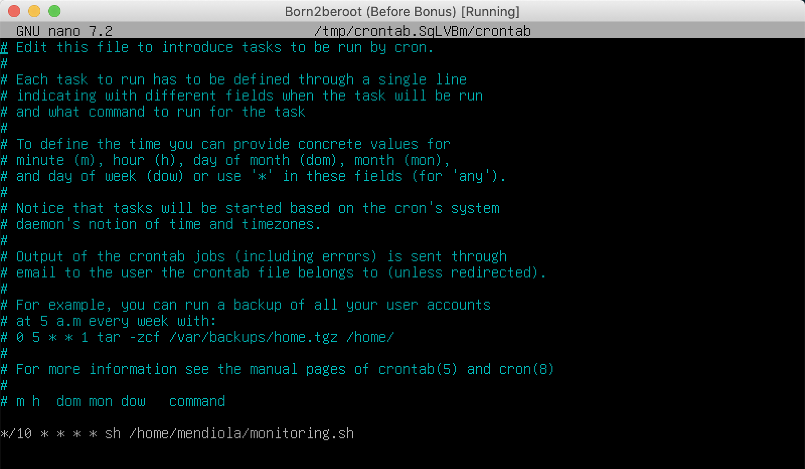

# 6 - Crontab

**What is crontab?** It is a background process scheduler. The specified processes will be executed at the time you specify in the crontab file.

To configure this file, use `sudo crontab -u root -e`.  

Add `*/10 * * * * sh /path/to/script` to execute the script every 10 minutes.

Explanation of each parameter:

**m** → Corresponds to minutes, ranging from 0 to 59.

**h** → Corresponds to hours, ranging from 0 to 23, with 0 being midnight.

**dom** → Represents the day of the month. If set to 10, it will run on the 10th of that month.

**dow** → Represents the day of the week, ranging from 0 (Monday) to 7 (Sunday) or the first three letters of the day in English: mon, tue, wed, thu, fri, sat, sun.

**user** → The user who will execute the command.

**commando** → The script to be executed or its path.