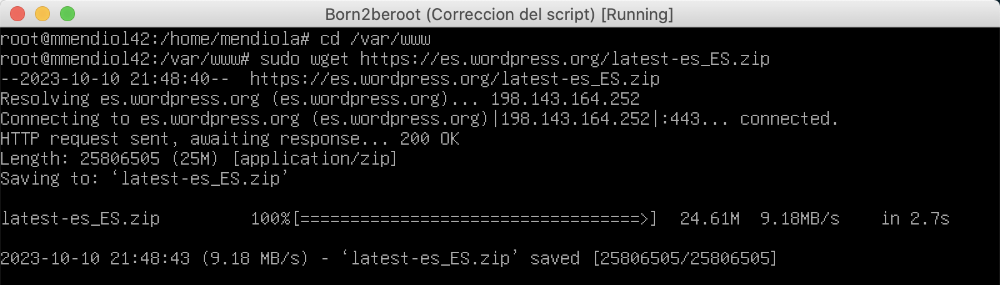
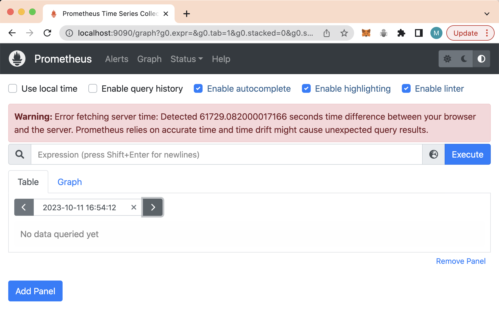

# 7 - Prometheus & Grafana Bonuses

These bonuses consist of three distinct parts:

- The first bonus involves setting up partitions during Debian installation.
- Adding a functional WordPress with the services of lighttpd, MariaDB, and PHP.
- Adding a service of your choice; in this case, we will use Prometheus & Grafana.

## 7.2 - Functional WordPress.

### Lighttpd

**What is Lighttpd❓** It is a web server designed to be fast, secure, flexible, and compliant with standards. It is optimized and consumes less CPU and RAM than other servers.

1. Install lighttpd packages with `sudo apt install lighttpd`.
    
    
    
     
    
2. Allow connections on port 80 with `sudo ufw allow 80` and confirm the port 80 connection with `sudo ufw status`.
    
    
    
     
    
3. Add port 80 to port forwarding in VirtualBox settings → Network → Advanced → Port Forwarding → Add Port 80. Confirm all changes.
    
    
    
     
    

### WordPress

**What is WordPress❓** It is a content management system focused on creating various types of websites and managing content with a vast array of existing plugins.

1. First, install wget and zip to manage file downloads and compression/decompression with `sudo apt install wget zip`.
    
    
    
     
    
2. Access the `/var/www` folder with `cd` and install the latest version of WordPress in Spanish with: `sudo wget https://es.wordpress.org/latest-es_ES.zip`.
    
    
    
     
    
3. Unzip the downloaded file with `sudo unzip latest-es_ES.zip`.
    
    
    
     
    
4. Rename the html folder with `sudo mv html html_old`.
    
    
    
     
    
5. Rename the wordpress folder to html with `sudo mv wordpress html`.
    
    
    
     
    
6. Give read, write, and execute permissions to the new html folder for the owner, groups, and others with the command `sudo chmod 755 -R html`.
    
    
    
     
    

### MariaDB

**What is MariaDB❓** It is a database used for various purposes, such as data storage, e-commerce, enterprise-level functions, and logging applications.

1. Install MariaDB packages with `sudo apt install mariadb-server`.
    
    
    
     
    
2. To secure the MariaDB installation, use a script provided by the mariadb-server package with the command `sudo mysql_secure_installation`.
    
    This command prompts a series of questions:
    
    ```c
    Switch to unix_socket autentication? → N
    Change the root password? → N
    Remove anonymous users? → Y
    Disallow root login remotely? → Y
    Remove test database and acces to it? → Y
    Reaload privilege tables now? → Y
    ```
    
    - Switch to unix_socket authentication? Since we have a protected root account, choose `N`.
    - Change the root password? By default, we don't have a password, and we don't want to change the root user password, so choose `N`.
    - Remove anonymous users? By default, there's an anonymous user, so anyone can access without an account. Choose `Y`.
    - Disallow root login remotely? We do this to prevent anyone from guessing the root user password or accessing remotely. Choose `Y`.
    - Remove test database and access to it? This removes the test database and test users, so choose `Y`.
    - Reload privilege tables now? To apply the changes immediately to MYSQL's permission tables, choose `Y`.
    
    
    
    
    
     
    
3. After finishing the MariaDB installation process, create the database and user. First, access mariadb with `mariadb`. Then create the database using the command `CREATE DATABASE wp_database;`.
    
    
    
     
    
4. Confirm that it was created correctly with `SHOW DATABASES;`.
    
    
    
     
    
5. Now, create a user using `CREATE USER 'user'@'localhost' IDENTIFIED BY '12345';`.
    
    
    
     
    
6. Now, we will add the user to our database, granting sufficient permissions for work, using `GRANT ALL PRIVILEGES ON wp_database.* TO 'user'@'localhost';`.
    
    
    
     
    
7. Update the permissions to make the changes take effect with `FLUSH PRIVILEGES;`.
    
    
    
     
    
8. Once completed, exit MariaDB with either `exit` or `ctrl + z`.
    
    
    
     
    

### PHP and WordPress Configuration.

**What is PHP❓**  It is a programming language primarily used for developing dynamic applications and interactive websites. PHP runs on the server-side.

1. First, install the necessary packages to run PHP and connect to a MySQL database with `sudo apt install php-cgi php-mysql`.
    
    
    
     
    
2. Navigate to the `/var/www/html` directory using cd. From there, copy the file named `wp-config-sample.php` as `wp-config.php` using `cp`.
    
    
    
     
    
3. Once created, modify the file with `nano wp-config.php`.
    
    
    
    Replace the data with your own, as shown in the following image.
    
    
    
      
    
4. To enhance performance and speed up applications on the server, use Lighttpd and one of its modules with the command `sudo lighty-enable-mod fastcgi`. Also, improve PHP-based server performance with `sudo lighty-enable-mod fastcgi-php`.
    
    
    
     
    
5. Following that, as instructed, force a reload of the lighttpd service with `sudo service lighttpd force-reload`.
    
    
    
     
    
6. To check the service status, use `sudo service lighttpd status`.
    
    
    
     
    
7. Once the above steps are completed, access the service through the browser using `localhost`.
    
    
    
     
    
8. Next, fill in the required fields; in my case, it will end up like this.
    
    
    
     
    
9. After clicking on `Install WordPress`, you can see the functional website by typing `localhost` in your browser.
    
    
    
     
    
10. Once you press `Log In` or enter [`localhost/wp-admin`](http://localhost/wp-admin) in the browser, you will access the WordPress system administration panel by entering your chosen username and password.
    
    
    
     
    
11. Here, you can modify and customize this website to your liking, but since nothing specific is mentioned in our subject, we won't cover that here.
    
    
    
     
    

## 7.3 - Download and Install Prometheus.

We will follow a [Guide](https://www.linode.com/docs/guides/how-to-install-prometheus-and-grafana-on-ubuntu/) for this part.

**Prometheus** is an open-source application monitoring system that collects metrics from the server at regular intervals. It can monitor its server and external client servers. Each client must run its metrics collection tool to put up their statistics, and it should be in this way. It uses the HTTP protocol, and for use, it's recommended to have its node exporter tool. Prometheus also collects a lot of data, including CPU and memory usage.

**Grafana** is an open-source, enterprise-level visualization application. Instead of collecting information, it uses information collected by Prometheus or another data source in a more intuitive and visual format presented on a dashboard defined as a template. It has different templates and allows users to create their templates and run their queries. It can also connect to SQL or NoSQL databases and have applications to apply tickets such as Jira and GitLab.

We will download this service from its [GitHub](https://github.com/prometheus/prometheus) page.

### Download and Install Prometheus.

1. Visit the [Prometheus](https://prometheus.io/download/) website to find the current version.
2. Download Prometheus using wget and the GitHub URL: ``wget [https://github.com/prometheus/prometheus/releases/download/v2.37.6/prometheus-2.37.6.linux-amd64.tar.gz](https://github.com/prometheus/prometheus/releases/download/v2.37.6/prometheus-2.37.6.linux-amd64.tar.gz)`.
    
    
    
     
    
3. Now, extract the Prometheus file with `tar xvfz prometheus-*.tar.gz`, and after extracting, you can delete the compressed file if desired with `rm`.
    
    
    
    And then you can delete the compressed file.
    
    
    
     
    
4. We will create two different directories using `sudo mkdir`, the first one will be `/etc/prometheus`, which will store configuration files, and `/var/lib/prometheus`, which will store application data.
    
    
    
     
    
5. Now, we will enter the Prometheus directory that we extracted, and then we will move the `prometheus` and `promtool` directories to the `/usr/local/bin/` directory to make Prometheus accessible to all users using `sudo mv prometheus promtool /usr/local/bin/`.
    
    
    
     
    
6. Next, we will move the YAML configuration `prometheus.yml` to the `/etc/prometheus` directory using `sudo mv prometheus.yml /etc/prometheus`.
    
    
    
     
    
7. Move the `consoles` and `consoles_libraries` directories to the `/etc/prometheus` directory using `sudo mv consoles consoles_libraries /etc/prometheus`.
    
    
    
     
    
8. Finally, we will check the Prometheus version with `prometheus —version`.
    
    
    
     
    

### Configure Prometheus as a Service.

Prometheus can be started and stopped from the command line, but it is more convenient to run the service using the `systemctl` utility.

To use this service, we need to add extra configuration to the `prometheus.yml` file.

1. Since we are using port 9090, we need to allow this port in ufw with the command `sudo ufw allow 9090` and verify that it has been added correctly with `sudo ufw status`.
    
    
    
     
    
2. Simultaneously, we need to add port 9090 in VirtualBox Settings → Network → Advanced → Port Forwarding.
    
    
    
     
    
3. Create a prometheus user with `sudo useradd -rs /bin/false prometheus` and proceed to give ownership of the two directories we created with the command `sudo chown -R prometheus: /etc/prometheus /var/lib/prometheus`.
    
    
    
     
    
4. To allow Prometheus to run as a service, create the `prometheus.service` file in the `/etc/systemd/system/` directory and add the following content with the command `sudo vi /etc/systemd/system/prometheus.service`:
    
    ```c
    [Unit]
    Description=Prometheus
    Wants=network-online.target
    After=network-online.target
    
    [Service]
    User=prometheus
    Group=prometheus
    Type=simple
    Restart=on-failure
    RestartSec=5s
    ExecStart=/usr/local/bin/prometheus \
        --config.file /etc/prometheus/prometheus.yml \
        --storage.tsdb.path /var/lib/prometheus/ \
        --web.console.templates=/etc/prometheus/consoles \
        --web.console.libraries=/etc/prometheus/console_libraries \
        --web.listen-address=0.0.0.0:9090 \
        --web.enable-lifecycle \
        --log.level=info
    
    [Install]
    WantedBy=multi-user.target
    ```
    
    - `Wants` and `After` must be equivalent to `network-online.target`.
    - `User` and `Group` must be set to `prometheus`.
    - `ExecStart` explains where to find the `prometheus` executable and sets the default option.
    - `config.file` defines the location of the Prometheus configuration file at `/etc/prometheus/prometheus.yml`.
    - `storage.tsdb.path` tells Prometheus where to store information in the `/var/lib/prometheus/` directory.
    - `web.listen-address` is set to `0.0.0.0:9090`, allowing Prometheus to listen to connections from all network interfaces.
    - The `web.enable-lifecycle` option allows the user to reload the configuration without resetting it.
        
        
        
         
        
5. Reload the `systemctl daemon` with `sudo systemctl daemon-reload`.
    
    
    
     
    
6. Configure Prometheus to start the service automatically with the command `sudo systemctl enable prometheus`.
    
    
    
     
    
7. Next, start the Prometheus service with `sudo systemctl start prometheus` and check that it is active with `sudo systemctl status prometheus`.
    
    If starting the service fails, use `journalctl -u prometheus -f —no-pager` to review the error output.
    
    
    
     
    
8. To access the Prometheus control panel, go to the address `[localhost:9090](http://localhost:9090)`.
    
    
    
     
    
9. To view all the targets indicated by Prometheus, navigate to `Status` and check the `Targets`.
    
    
    
10. At this point, the project would be completed with all the necessary bonuses for the maximum project score. I hope this has been able to help you in every way possible.