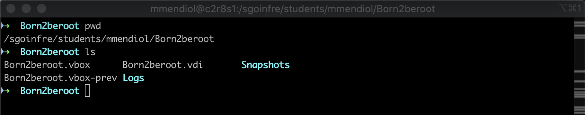

# 8 - Signature.txt

To obtain the signature, the first thing we need to do is shut down the virtual machine since turning it on or making any modifications will alter the signature.

The next step is to navigate to the path where we have the .vdi of our virtual machine.

🧠 **What is shasum❓** It is a command that allows identifying the integrity of a file by computing the SHA-1 hash checksum of a file.

Finally, execute `shasum MACHINE-NAME.vdi`, and this will provide us with the signature. The result of this signature is what we need to add to our signature.txt file for later uploading to the intra repository, so **DO NOT OPEN THE MACHINE AGAIN ONCE THIS STEP IS COMPLETED.**

For corrections, remember to `clone the machine` so that you can start it without worrying about changing the signature.