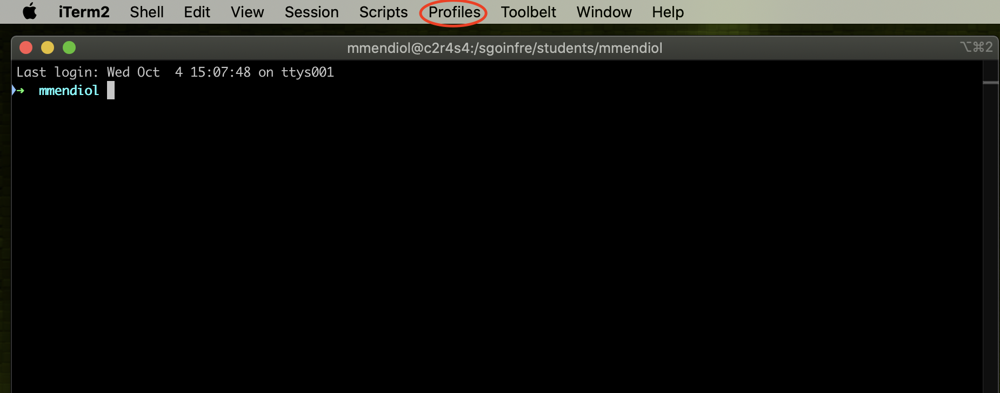
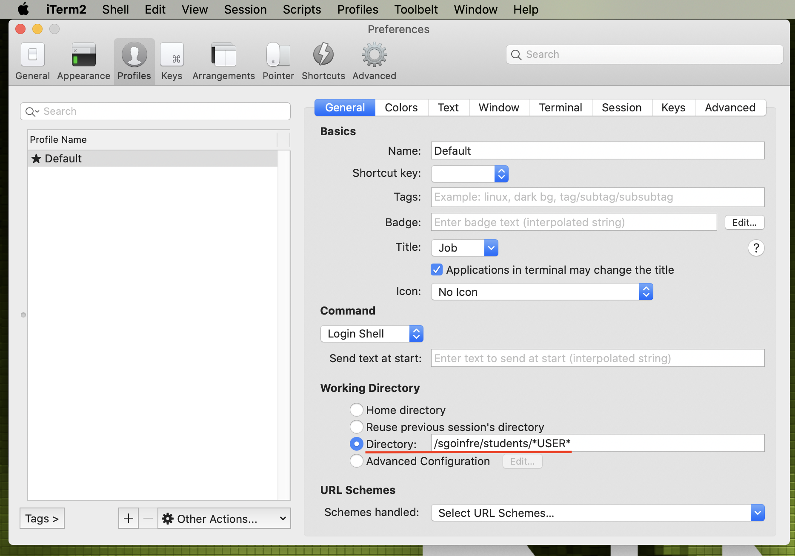

# iTerm Directory Change

1. Open iTerm and go to Profiles.
    
    
    
     
    
2. Inside Profiles, click on the default one and select Edit Profiles.
    
    
    
     
    
3. The Working Directory is initially set to Home, but we will change it to a custom directory. To find the URL, we will use `pwd` to determine the address we should use.
    
    