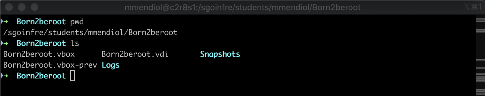

# 8 - Signature.txt

Para obtener la firma lo primero que debemos hacer es apagar la máquina virtual ya que una vez la enciendas o modifiques algo la firma cambiará.

El siguiente paso será ubicarnos en la ruta donde tengamos el .vdi de nuestra maquina virtual.

🧠 **Que es shasum❓** Es un comando que permite identificar la integridad de un fichero mediante la suma de comprobación del hash SHA-1 de un archivo.

Por último haremos `shasum NOMBRE-MAQUINA.vdi` y esto nos dara la firma. El resultado de esta firma es lo que tendremos añadir a nuestro fichero signature.txt para posteriormente subir el fichero al repositorio de la intra, por lo que **NO LA VUELVAS A ABRIR LA MAQUINA UNA VEZ TERMINADO ESTE PASO.** 

Para las correcciones recuerda `clonar la maquina` ya que asi podras encenderla sin miedo a que cambie la firma.