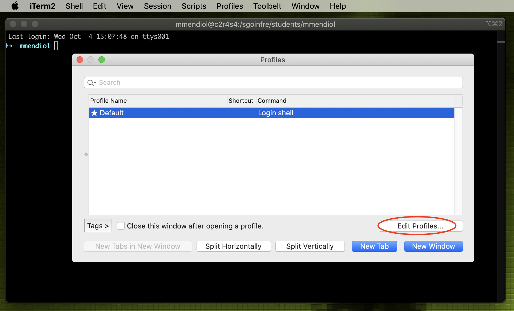
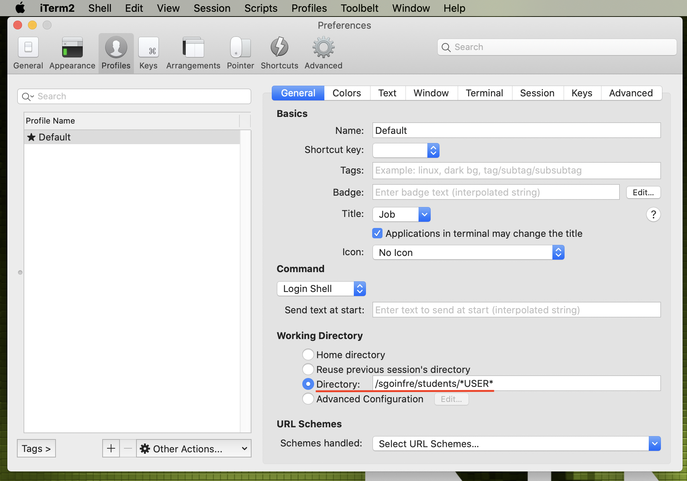

# Cambio de directorio de iTerm

1. Abrimos iTerm y entramos en Perfiles.
    
    
    
     
    
2. Al entrar en Perfiles clickamos en el de por defecto y le damos en editar perfiles.
    
    
    
     
    
3. El Directorio de Trabajo estara en el Home pero nosotros lo cambiaremos a un directorio personalizado. Para encontrar la url usaremos `pwd` para saber cual es la direccion que deberemos usar.
    
    